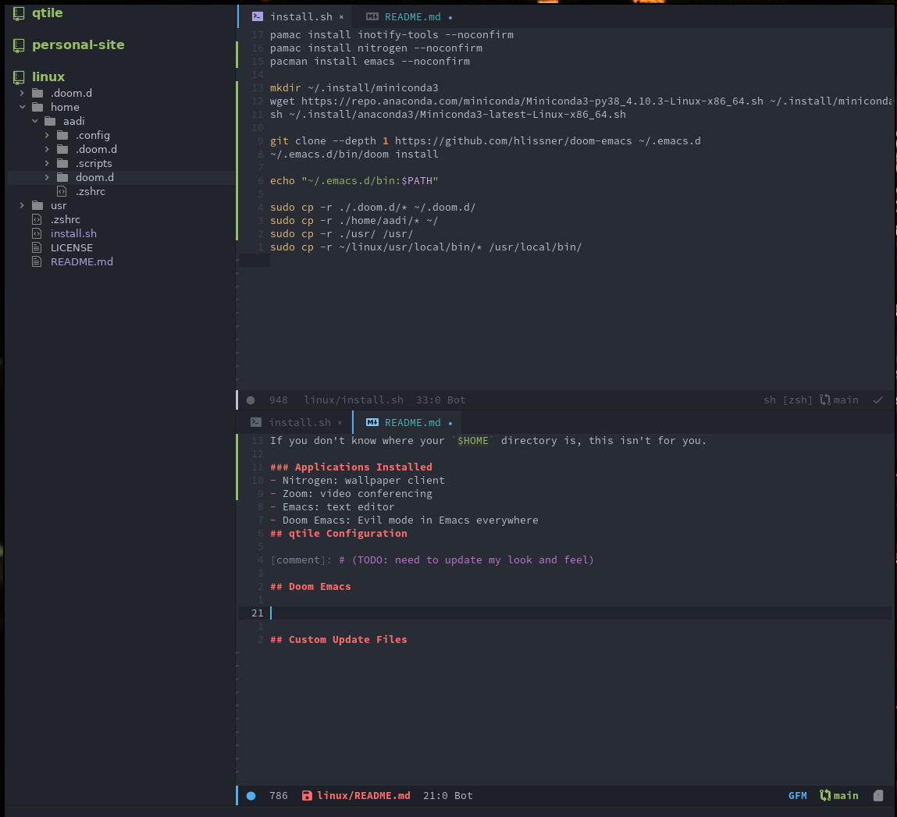

# Aadi's Dotfiles
This is a collection of all my configuration files used on Manjaro, if you want to give this a try, you can use the [install script](install.sh). 
Full disclaimer, there is no guarantee that this code is bug-free, this is what works for me on a daily, and is designed to be minimal and functional (but not necessarily full attractive)

## Install Script

This assumes that you cloned the GitHub repo into your `$HOME` directory.
If you don't know where your `$HOME` directory is, this isn't for you.

### Applications Installed 
- Nitrogen: wallpaper client
- Zoom: video conferencing
- Emacs: text editor
- Doom Emacs: Evil mode in Emacs everywhere
## qtile Configuration

[comment]: # (TODO: need to update my look and feel)

## Doom Emacs

My **emacs** configuration depends near completely on [Doom](https://github.com/hlissner/doom-emacs), as shown above. Syntax highlighting is turned on, I use [neotree](https://github.com/hlissner/doom-emacs) for the file-tree, and have a list of plugins enabled in my [doom config](.doom.d)

## Other Configuration Files
- qtile: configured to auto-start particular programs, and looks like the interface as shown above
- bin: custom homepage configured to point to personal webpages (requires authentication)
- local/bin: scripts to keep this repo updated
